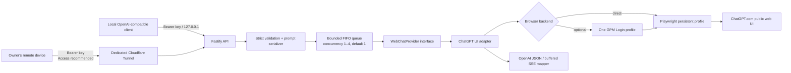

# tab2api

`tab2api` is a local-first, unofficial OpenAI-compatible REST bridge to **your own manually logged-in ChatGPT.com browser session**. It supports text chat, image input, UI image generation, and UI-mediated audio transcription. Local OS speech synthesis provides a clearly labelled WAV compatibility endpoint.

This is browser automation, not the official OpenAI API. It may break whenever ChatGPT's UI changes. It is intended for one user on a personal computer, is not suitable for production, and must never be hosted as a shared or public proxy.

## Architecture



No private ChatGPT endpoint is called. Direct Playwright uses its private transport. Optional GPM mode validates both the Local API and returned DevTools WebSocket as loopback-only. The REST server rejects every host except `127.0.0.1` and `::1`.

Optional remote access is for the same owner's devices only. The origin remains loopback and every device needs an independent revocable tab2api key. Cloudflare Access is recommended; an explicitly selected bearer-only mode is also documented. See [the Cloudflare guide](docs/cloudflare.md).

## Prerequisites

- Node.js 22 or newer and npm
- A ChatGPT account you own and are allowed to use
- An interactive desktop for the first manual login
- Either Chromium installed for direct Playwright (`npx playwright install chromium`) or GPM Login with one dedicated existing profile

## Windows PowerShell quickstart

```powershell
git clone https://github.com/your-name/tab2api.git
Set-Location tab2api
npm ci
Copy-Item .env.example .env
# For GPM mode, set TAB2API_GPM_PROFILE_ID in .env to the one profile UUID shown by GPM Login.
npm run login
```

A dedicated browser opens. Log in yourself; do not enter credentials into the terminal. Complete any CAPTCHA or security challenge manually. When the CLI reports `ready`, start the bridge in a new PowerShell window:

```powershell
Set-Location tab2api
npm run build
npm start
$token = (Get-Content .tab2api/api-token -Raw).Trim()
```

On first configuration load, a cryptographically random local API token is written to `.tab2api/api-token`; its value is never logged.

## macOS/Linux quickstart

```bash
git clone https://github.com/your-name/tab2api.git
cd tab2api
npm ci
npx playwright install chromium
cp .env.example .env
npm run login
npm run build && npm start
```

In another shell: `TOKEN="$(tr -d '\r\n' < .tab2api/api-token)"`.

## Requests

Chat Completions (PowerShell uses `curl.exe`, not the `curl` alias):

```powershell
curl.exe http://127.0.0.1:3210/v1/chat/completions `
  -H "Authorization: Bearer $token" `
  -H "Content-Type: application/json" `
  -d '{"model":"chatgpt-web","messages":[{"role":"system","content":"Be concise."},{"role":"user","content":"Explain FIFO in one sentence."}]}'
```

Responses:

```powershell
curl.exe http://127.0.0.1:3210/v1/responses `
  -H "Authorization: Bearer $token" `
  -H "Content-Type: application/json" `
  -d '{"model":"chatgpt-web","instructions":"Be concise.","input":"What is local-first software?"}'
```

An OpenAI-compatible JavaScript client can point at the local server:

```ts
import OpenAI from 'openai';
import { readFileSync } from 'node:fs';

const client = new OpenAI({
  baseURL: 'http://127.0.0.1:3210/v1',
  apiKey: readFileSync('.tab2api/api-token', 'utf8').trim(),
});
const result = await client.chat.completions.create({
  model: 'chatgpt-web',
  messages: [{ role: 'user', content: 'Hello' }],
});
```

The `openai` package is only an example client and is not a tab2api dependency.

Image generation:

```powershell
curl.exe http://127.0.0.1:3210/v1/images/generations `
  -H "Authorization: Bearer $token" `
  -H "Content-Type: application/json" `
  -d '{"model":"chatgpt-web-image","prompt":"A blue circle on white","response_format":"b64_json"}'
```

Speech and transcription use `/v1/audio/speech` (JSON, WAV output) and `/v1/audio/transcriptions` (multipart). See [the API reference](docs/api.md) for exact schemas and media limits.

## First login and normal operation

`npm run login` launches the selected dedicated profile and waits until the composer is compatible. `npm start` reuses that profile. Each API request opens a fresh ChatGPT page/conversation and closes it afterward. `TAB2API_CONCURRENCY` controls 1–4 parallel browser tabs; the safe default is one, with a bounded FIFO queue. Start with 2 only after a live test because one account may rate-limit and UI tabs consume substantial memory. `npm run doctor` checks Node, the selected browser backend, directory permissions, port, local token, browser connectivity, login, and selectors. `npm run reset-session` closes the bridge browser process through the authenticated admin route without deleting the profile.

### Windows autostart

After configuring `.env` and building, install a per-user Scheduled Task:

```powershell
npm run build
npm run autostart:install
npm run autostart:status
```

The task starts at interactive user logon, runs in the background, and uses a bounded watchdog plus Task Scheduler restart settings after process failures. Its redacted structured output is written to ignored `.tab2api/service.log`. GPM Login must also start with Windows and remain signed in. This is best-effort desktop availability, not a production uptime guarantee: logout, sleep/power loss, ChatGPT challenges, rate limits, UI changes, or GPM being unavailable stop useful generation. Remove it with `npm run autostart:remove`.

### GPM Login backend

Set `TAB2API_BROWSER_BACKEND=gpm`, `TAB2API_GPM_PROFILE_ID=<one-profile-uuid>`, and the actual loopback Local API URL in `.env`. Start the GPM Login desktop app before `npm run login` or `npm start`. If GPM selected a fallback port instead of 9495, update `TAB2API_GPM_BASE_URL` using its local `http.port` value. tab2api calls only get/start/stop for that profile; it does not create, list, modify, delete, or rotate profiles and does not manage proxies or fingerprints.

GPM's Local API and DevTools port are separate unauthenticated loopback services. A malicious process running as the same OS user could target them, so direct Playwright remains the lower-risk backend.

GPM mode ignores `TAB2API_HEADLESS`; window behavior is controlled by GPM Login. Stopping tab2api, completing `npm run login`, or calling reset stops the configured GPM browser while preserving its profile data. GPM does not make ChatGPT selectors stable by itself; UI changes can still require an adapter update.

### Rust/Tauri desktop app

`desktop/` contains a Tauri 2 control app for users who do not want Node.js, Chrome, Playwright, or GPM installed separately. Rust owns the native window, tray, app-local paths, and bounded child lifecycle; the packaged Node sidecar retains the tested Fastify/Playwright implementation. ChatGPT opens in the bundled dedicated Chromium window for manual login and is never embedded in the operating-system WebView.

On Windows, build an unsigned self-contained preview with:

```powershell
npm ci
npm run desktop:check
npm run desktop:build:windows
npm run desktop:smoke:windows
```

The preparation step stages production dependencies and downloads only the Playwright-matched headed Chromium revision. Generated resources, installers, runtime data, and profiles are ignored by Git. The output under `desktop/target/release/bundle/nsis/` is a developer preview; public releases still require code signing and clean-machine installation tests. See [the desktop guide](docs/desktop.md).

### Per-device keys, usage, and private remote access

The original `.tab2api/api-token` is the administrator key. Create revocable non-admin keys for other personal devices with `npm run keys -- create "personal laptop"`; the plaintext is printed once and only its SHA-256 digest is persisted. `npm run keys -- list`, `npm run keys -- revoke <id>`, and `npm run usage` manage keys and inspect content-free counters.

Usage includes real request/success/failure, latency, and byte counters. Token totals are explicitly estimated because ChatGPT Web exposes no authoritative usage. They are not suitable for billing. For `tab2api.tangvu.dev`, follow [docs/cloudflare.md](docs/cloudflare.md). The default installer verifies Access; the separate bearer-only command requires explicit operator selection.

## Supported API and limitations

- `GET /healthz`, `GET /readyz`, `GET /v1/models`
- `POST /v1/chat/completions`, `POST /v1/responses`
- `POST /v1/images/generations`
- `POST /v1/audio/speech`, `POST /v1/audio/transcriptions`
- `POST /admin/session/reset`
- `GET/POST/DELETE /admin/api-keys`, `GET/DELETE /admin/usage` (administrator only)
- Text messages with `system`, `developer`, `user`, and prior `assistant` roles; vision accepts bounded PNG/JPEG/WebP data URLs. Remote image URLs are rejected.
- The truthful model is always `chatgpt-web`. A different incoming model string is client metadata and does not control the ChatGPT UI model picker.
- Tool calls, image editing, live voice/realtime audio, MP3 TTS, JSON schema output, logprobs, and accurate sampling/model controls are not supported.
- Image output is a lossless PNG rendered from the UI element at its intrinsic pixel dimensions, not the smaller chat preview. It preserves UI-exposed pixels but is not the source asset byte-for-byte and may omit metadata. Only `n=1`, `size=auto`, `quality=auto`, and `b64_json` are accepted.
- TTS uses the local OS voice engine and returns WAV; it is not ChatGPT/OpenAI speech. STT uploads the audio through the UI and therefore cannot assert an exact transcription model.
- Token counts are not visible in the UI. Chat Completions returns zero counts with `tab2api.usage_available=false`; Responses returns `usage: null`. These values mean “unknown,” not zero actual usage.
- `stream: true` is a **buffered fallback**: generation finishes in the browser, then one text delta is sent. Chat Completions ends with `[DONE]`; Responses ends with `response.completed`. It is not live token streaming.
- UI text extraction preserves visible multiline/code/list text but may differ from original Markdown source.
- ChatGPT UI changes, localization, experiments, rate limits, account policy, network conditions, and security challenges can break operation. No challenge is bypassed and an ambiguous submitted prompt is never retried automatically.

## Security

The dedicated profile grants access to your logged-in session: protect it like a credential. Do not sync or share `.tab2api`, screenshots, logs, token files, Cloudflare credentials, or service-token secrets. Never point `TAB2API_PROFILE_DIR` at your normal browser profile. Keep the server itself on loopback and use one revocable client key per remote device. See [the threat model](docs/security.md) and [architecture decisions](docs/architecture.md).

## Troubleshooting

Run `npm run doctor` first. Common fixes include `npx playwright install chromium`, closing a stale tab2api browser, and `npm run login`. Do not automate a CAPTCHA; complete it in the headed browser. More cases are in [docs/troubleshooting.md](docs/troubleshooting.md).

## Development

```text
npm run dev          watch-mode server
npm run build        production TypeScript build
npm start            run built server
npm test             offline unit/integration tests
npm run check        typecheck, lint, formatting check
npm run login        manual dedicated-profile login
npm run doctor       environment/session diagnostics
npm run smoke        offline fake-adapter API smoke test
npm run keys -- create "device label" # print one revocable client key once
npm run keys -- list                  # list key metadata, never secrets
npm run usage                         # per-key content-free usage estimates
npm run desktop:check                 # UI syntax + Rust fmt/clippy/tests
npm run desktop:dev                   # native shell with the development sidecar
npm run desktop:build:windows         # self-contained unsigned NSIS preview
npm run desktop:smoke:windows         # packaged sidecar lifecycle smoke
npm run autostart:install # Windows per-user startup task
npm run autostart:status  # Windows task and loopback liveness
npm run autostart:remove  # remove task; preserve runtime/profile
npm run tunnel:install    # fail-closed Access check + tunnel startup task
npm run tunnel:install:bearer-only # explicit single-owner bearer-only mode
npm run tunnel:status     # inspect tunnel task
npm run tunnel:remove     # stop/remove tunnel task; preserve DNS/credentials
```

Manual E2E is never part of CI. After reviewing its prompt and logging into the dedicated profile, explicitly opt in with `$env:TAB2API_MANUAL_E2E='1'; npm run test:manual` on PowerShell or `TAB2API_MANUAL_E2E=1 npm run test:manual` on macOS/Linux. Without that variable, the manual test is skipped.

See [API details](docs/api.md), [Cloudflare remote access](docs/cloudflare.md), [contributing](CONTRIBUTING.md), and the [Vietnamese README](README_VI.md). Licensed under MIT.
