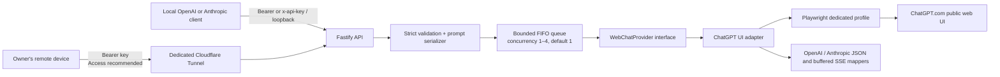

# tab2api

[](https://github.com/tang-vu/tab2api/actions/workflows/ci.yml)
[](https://github.com/tang-vu/tab2api/actions/workflows/desktop.yml)
[](package.json)
[](LICENSE)

`tab2api` is a local-first, unofficial OpenAI- and Anthropic-Messages-compatible REST bridge to **your own manually logged-in ChatGPT.com browser session**. It supports text chat, Claude Code client-side tool loops, image input, UI image generation, and UI-mediated audio transcription. Local OS speech synthesis provides a clearly labelled WAV compatibility endpoint.

This is browser automation, not the official OpenAI API. It may break whenever ChatGPT's UI changes. It is intended for one user on a personal computer, is not suitable for production, and must never be hosted as a shared or public proxy.

tab2api is an independent community project. It is not affiliated with, endorsed by, or sponsored by OpenAI, ChatGPT, Cloudflare, Microsoft, Google, or the maintainers of its other dependencies. Product and company names are trademarks of their respective owners. Users are responsible for complying with the terms and policies of every service they use.

## Architecture



No private ChatGPT endpoint is called. Direct Playwright uses its private transport, while the desktop shell exposes only an ephemeral loopback CDP endpoint to its own sidecar. The REST server rejects every host except `127.0.0.1` and `::1`.

Optional remote access is for the same owner's devices only. The origin remains loopback and every device needs an independent revocable tab2api key. Cloudflare Access is recommended; an explicitly selected bearer-only mode is also documented. See [the Cloudflare guide](docs/cloudflare.md).

## Prerequisites

- Node.js 22.13 or newer and npm
- A ChatGPT account you own and are allowed to use
- An interactive desktop for the first manual login
- Chromium installed for direct Playwright (`npx playwright install chromium`); the packaged desktop app bundles its matched Chromium revision

## Windows PowerShell quickstart

```powershell
git clone https://github.com/tang-vu/tab2api.git
Set-Location tab2api
npm ci
Copy-Item .env.example .env
npm run login
```

A dedicated browser opens. Log in yourself; do not enter credentials into the terminal. Complete any CAPTCHA or security challenge manually. When the CLI reports `ready`, start the bridge in a new PowerShell window:

```powershell
Set-Location tab2api
npm run build
npm start
$token = (Get-Content .tab2api/api-token -Raw).Trim()
```

On first configuration load, a cryptographically random local API token is written to `.tab2api/api-token`; its value is never logged.

## macOS/Linux quickstart

```bash
git clone https://github.com/tang-vu/tab2api.git
cd tab2api
npm ci
npx playwright install chromium
cp .env.example .env
npm run login
npm run build && npm start
```

In another shell: `TOKEN="$(tr -d '\r\n' < .tab2api/api-token)"`.

## Requests

Chat Completions (PowerShell uses `curl.exe`, not the `curl` alias):

```powershell
curl.exe http://127.0.0.1:3210/v1/chat/completions `
  -H "Authorization: Bearer $token" `
  -H "Content-Type: application/json" `
  -d '{"model":"chatgpt-web","messages":[{"role":"system","content":"Be concise."},{"role":"user","content":"Explain FIFO in one sentence."}]}'
```

Responses:

```powershell
curl.exe http://127.0.0.1:3210/v1/responses `
  -H "Authorization: Bearer $token" `
  -H "Content-Type: application/json" `
  -d '{"model":"chatgpt-web","instructions":"Be concise.","input":"What is local-first software?"}'
```

An OpenAI-compatible JavaScript client can point at the local server:

```ts
import OpenAI from 'openai';
import { readFileSync } from 'node:fs';

const client = new OpenAI({
  baseURL: 'http://127.0.0.1:3210/v1',
  apiKey: readFileSync('.tab2api/api-token', 'utf8').trim(),
});
const result = await client.chat.completions.create({
  model: 'chatgpt-web',
  messages: [{ role: 'user', content: 'Hello' }],
});
```

The `openai` package is only an example client and is not a tab2api dependency.

### Claude Code

Create a dedicated revocable client key with the desktop app's **Keys & Usage** tab or `npm run keys -- create "Claude Code"`. The one-time desktop dialog can copy the complete PowerShell setup below, including that new key, without persisting it. Configure only the current PowerShell process:

```powershell
$env:ANTHROPIC_BASE_URL = 'http://127.0.0.1:3210'
$env:ANTHROPIC_AUTH_TOKEN = '<one-time-revocable-client-key>'
$env:CLAUDE_CODE_DISABLE_NONESSENTIAL_TRAFFIC = '1'
claude --model claude-tab2api-chatgpt-web
```

Do not put the key in a committed `.claude/settings.json`. `POST /v1/messages` translates Claude Code's text, image, and declared client-tool blocks to the public ChatGPT UI; tool requests are parsed from a bounded envelope, restricted to names the client supplied, assigned server-generated ids, and returned to Claude Code for its normal permission checks and execution. `POST /v1/messages/count_tokens` is a local byte-based estimate and does not spend a browser request. Streaming starts immediately with keepalive pings but the answer/tool block remains buffered until the UI finishes.

This compatibility mode does **not** turn ChatGPT Web into a Claude model and is not supported by Anthropic as a non-Claude gateway. Model behavior, tool reliability, context handling, and output limits remain those of the visible ChatGPT UI and may change. Run `npm run smoke:claude` to exercise the installed Claude Code binary, SSE protocol, and a harmless two-turn `Read package.json` tool loop entirely against the offline fake adapter.

Image generation:

```powershell
curl.exe http://127.0.0.1:3210/v1/images/generations `
  -H "Authorization: Bearer $token" `
  -H "Content-Type: application/json" `
  -d '{"model":"chatgpt-web-image","prompt":"A blue circle on white","response_format":"b64_json"}'
```

Speech and transcription use `/v1/audio/speech` (JSON, WAV output) and `/v1/audio/transcriptions` (multipart). See [the API reference](docs/api.md) for exact schemas and media limits.

Working against a large codebase uses ChatGPT projects, so the sources are uploaded once instead of resent with every request:

```powershell
$project = (curl.exe http://127.0.0.1:3210/v1/projects `
  -H "Authorization: Bearer $token" -H "Content-Type: application/json" `
  -d '{"name":"my codebase"}' | ConvertFrom-Json).id

curl.exe "http://127.0.0.1:3210/v1/projects/$project/files" `
  -H "Authorization: Bearer $token" `
  -F "file=@src/index.ts;type=text/plain"

curl.exe "http://127.0.0.1:3210/v1/projects/$project/chat/completions" `
  -H "Authorization: Bearer $token" -H "Content-Type: application/json" `
  -d '{"model":"chatgpt-web","messages":[{"role":"user","content":"What does this project do?"}]}'
```

The reply carries `tab2api.conversation_id`; passing it back as `conversation_id` continues that same thread instead of starting a new conversation.

## First login and normal operation

`npm run login` launches the dedicated profile and waits until the composer is compatible. `npm start` reuses that profile. Each API request opens a fresh ChatGPT page/conversation and closes it afterward. `TAB2API_CONCURRENCY` controls 1–4 parallel browser tabs; the safe default is one, with a bounded FIFO queue. Start with 2 only after a live test because one account may rate-limit and UI tabs consume substantial memory. `npm run doctor` checks Node, Chromium, directory permissions, port, local token, browser connectivity, login, and selectors. `npm run reset-session` closes the bridge browser process through the authenticated admin route without deleting the profile.

### Windows autostart

After configuring `.env` and building, install a per-user Scheduled Task:

```powershell
npm run build
npm run autostart:install
npm run autostart:status
```

The task starts at interactive user logon, runs in the background, and uses a bounded watchdog plus Task Scheduler restart settings after process failures. Its redacted structured output is written to ignored `.tab2api/service.log`. This is best-effort desktop availability, not a production uptime guarantee: logout, sleep/power loss, ChatGPT challenges, rate limits, UI changes, or the browser being unavailable stop useful generation. Remove it with `npm run autostart:remove`.

### Rust/Tauri desktop app

`desktop/` contains a Tauri 2 control app for users who do not want Node.js, Chrome, or Playwright installed separately. Rust owns the native window, tray, app-local paths, and bounded child lifecycle; the packaged Node sidecar retains the tested Fastify/Playwright implementation. ChatGPT opens in the bundled dedicated Chromium window for manual login and is never embedded in the operating-system WebView.

The installed controller is single-instance: opening it again reveals the existing window instead of creating a second controller or sidecar owner. **Settings → Launch at sign-in** is an explicit, default-off native option. It opens the controller minimized in the system tray; it does not silently start the local API or browser. Do not combine this desktop flow with the source-tree Scheduled Task above for the same personal deployment.

On Windows, build an unsigned self-contained preview with:

```powershell
npm ci
npm run desktop:check
npm run desktop:build:windows
npm run desktop:smoke:windows
```

The preparation step stages production dependencies, downloads only the Playwright-matched headed Chromium revision, emits a production-dependency CycloneDX SBOM, and records SHA-256 plus size for every staged sidecar file. The packaged smoke verifies that inventory, runs an authenticated fake-adapter request offline, then checks loopback health and graceful shutdown. Generated resources, installers, runtime data, and profiles are ignored by Git. The output under `desktop/target/release/bundle/nsis/` is still an unsigned developer preview; the embedded inventory detects staging drift but is not a substitute for code signing, externally published checksums, provenance, or a signed release's broader clean-machine matrix. See [the desktop guide](docs/desktop.md).

Maintainers can manually dispatch the artifact-free `Desktop install smoke` workflow. It builds the unsigned preview on a fresh Windows runner, installs it silently into an isolated temporary directory, repeats the offline packaged smoke from the installed resources, uninstalls it, and verifies that app-local profile data is retained by default. The workflow never uploads or publishes the unsigned installer.

The desktop controller includes localized settings and a complete Cloudflare Tunnel onboarding guide in English, Vietnamese, Chinese, Japanese, Korean, Spanish, French, and German. It chooses the initial language from the operating-system locale locally—never from IP geolocation—and lets the user change the saved language at any time. Only the language code and optional public tunnel hostname are kept in WebView settings; the sign-in launch registration is owned by the operating system.

### Per-device keys, usage, and private remote access

The original `.tab2api/api-token` is the administrator key. With the local service running, create revocable non-admin keys for other personal devices with `npm run keys -- create "personal laptop"`; the plaintext is printed once and only its SHA-256 digest is persisted. `npm run keys -- list`, `npm run keys -- revoke <id>`, and `npm run usage` manage keys and inspect content-free counters through the live authenticated loopback API. The CLI first verifies the exact unauthenticated `/healthz` identity, refuses redirects and unrelated services without sending the key, and bounds the complete operation to ten seconds. It no longer opens a second mutable copy of the key/usage stores while the service owns them.

The desktop app provides the same workflow in its **Keys & Usage** tab while the local service is running. Its native layer requires the exact unauthenticated `/healthz` identity over a separate loopback connection before reading and sending the administrator key, then bounds and strictly validates the authenticated response. It lists metadata, creates a client key with one-time plaintext display, can explicitly copy either the raw key or an ephemeral Claude Code PowerShell setup, revokes with confirmation, shows/resets content-free usage, and never exposes the administrator key to the WebView. Its service card separately reports local process health and authenticated ChatGPT UI readiness, with a bounded on-demand check and localized remediation instead of calling a live browser check on every status poll. **API Docs** can export the canonical documentation as a new Markdown file in Downloads for use as LLM context; exported files contain no credentials.

Usage includes real request/success/failure, latency, and byte counters. Token totals are explicitly estimated because ChatGPT Web exposes no authoritative usage. They are not suitable for billing. For an optional owner-configured hostname, follow [docs/cloudflare.md](docs/cloudflare.md). The default installer verifies Access; the separate bearer-only command requires explicit operator selection.

## Supported API and limitations

- `GET /healthz`, `HEAD /api/hello`, `GET /readyz`, `GET /v1/models`
- `POST /v1/chat/completions`, `POST /v1/responses`, `POST /v1/messages`, `POST /v1/messages/count_tokens`
- `POST /v1/images/generations`
- `POST /v1/audio/speech`, `POST /v1/audio/transcriptions`
- `POST/GET /v1/projects`, `DELETE /v1/projects/:projectId`, `POST /v1/projects/:projectId/files`
- `POST /v1/projects/:projectId/chat/completions`, `POST /v1/projects/:projectId/responses`
- `POST /admin/session/reset`
- `GET/POST/DELETE /admin/api-keys`, `GET/DELETE /admin/usage` (administrator only)
- Text messages with `system`, `developer`, `user`, and prior `assistant` roles; vision accepts bounded PNG/JPEG/WebP data URLs. Remote image URLs are rejected.
- The truthful provider is always `chatgpt-web`. The Anthropic compatibility id `claude-tab2api-chatgpt-web` exists for Claude Code discovery; neither incoming id controls the ChatGPT UI model picker or claims that Claude served the request.
- OpenAI tool calls, image editing, live voice/realtime audio, MP3 TTS, JSON schema output, logprobs, and accurate sampling/model controls are not supported. Anthropic client-side tool use is a prompt-mediated compatibility bridge and can fail if the visible model does not follow its bounded output envelope.
- Image output is a lossless PNG rendered from the UI element at its intrinsic pixel dimensions, not the smaller chat preview. It preserves UI-exposed pixels but is not the source asset byte-for-byte and may omit metadata. Only `n=1`, `size=auto`, `quality=auto`, and `b64_json` are accepted.
- TTS uses the local OS voice engine and returns WAV; it is not ChatGPT/OpenAI speech. STT uploads the audio through the UI and therefore cannot assert an exact transcription model.
- Token counts are not visible in the UI. Chat Completions returns zero counts with `tab2api.usage_available=false`; Responses returns `usage: null`; Anthropic Messages returns zero usage and labels token counting as estimated. These values mean “unknown,” not zero actual usage.
- `stream: true` is a **buffered fallback**: generation finishes in the browser, then one text/tool delta is sent. Chat Completions ends with `[DONE]`; Responses ends with `response.completed`; Anthropic Messages opens immediately and sends bounded keepalive pings before its terminal events. None is live token streaming.
- UI text extraction preserves visible multiline/code/list text but may differ from original Markdown source.
- Project routes drive the same public UI. `GET /v1/projects` reads live browser state rather than a tab2api database, and because the grid exposes no identifier it opens each project to learn its id: roughly one navigation per project, capped at 25.
- `DELETE /v1/projects/:projectId` acts on whatever id the client supplies, so it can remove a project created outside tab2api, and deletion is irreversible. It resolves the id to a name and deletes the row with that name; two projects sharing a name are rejected rather than guessed between.
- A project keeps its uploaded files and instructions, but ChatGPT still governs how much of them a given answer uses. Project context is not a substitute for a large context window, and account-level memory is not isolated by a project.
- ChatGPT UI changes, localization, experiments, rate limits, account policy, network conditions, and security challenges can break operation. No challenge is bypassed and an ambiguous submitted prompt is never retried automatically.

## Security

The dedicated profile grants access to your logged-in session: protect it like a credential. Do not sync or share `.tab2api`, screenshots, logs, token files, Cloudflare credentials, or service-token secrets. Never point `TAB2API_PROFILE_DIR` at your normal browser profile. Startup resolves real filesystem targets and rejects profile/artifact escapes, directory links/reparse points, private-file symlinks or hard links, and known Chrome/Chromium/Edge default-profile component paths. Private state files are size-bounded and replaced atomically; a failed durable key/usage mutation leaves the last committed in-memory state intact. Same-user malware can still race or read files with that user's authority, so use a trusted account and disk encryption. Keep the server itself on loopback and use one revocable client key per remote device. See [the threat model](docs/security.md) and [architecture decisions](docs/architecture.md).

## Troubleshooting

Run `npm run doctor` first. Common fixes include `npx playwright install chromium`, closing a stale tab2api browser, and `npm run login`. Do not automate a CAPTCHA; complete it in the headed browser. More cases are in [docs/troubleshooting.md](docs/troubleshooting.md).

## Development

```text
npm run dev          watch-mode server
npm run build        production TypeScript build
npm start            run built server; keep it running for CLI administration
npm test             offline unit/integration tests
npm run check        typecheck, lint, formatting check
npm run login        manual dedicated-profile login
npm run doctor       environment/session diagnostics
npm run smoke        offline fake-adapter API smoke test
npm run smoke:claude installed Claude Code + offline two-turn Read tool smoke
npm run keys -- create "device label" # print one revocable client key once
npm run keys -- list                  # list key metadata, never secrets
npm run usage                         # per-key content-free usage estimates
npm run desktop:check                 # UI syntax + Rust fmt/clippy/tests
npm run desktop:dev                   # native shell with the development sidecar
npm run desktop:build:windows         # self-contained unsigned NSIS preview
npm run desktop:smoke:windows         # packaged sidecar lifecycle smoke
npm run autostart:install # Windows per-user startup task
npm run autostart:status  # Windows task and loopback liveness
npm run autostart:remove  # remove task; preserve runtime/profile
npm run tunnel:install    # fail-closed Access check + tunnel startup task
npm run tunnel:install:bearer-only # explicit single-owner bearer-only mode
npm run tunnel:status     # inspect tunnel task
npm run tunnel:remove     # stop/remove tunnel task; preserve DNS/credentials
```

Manual E2E is never part of CI. After reviewing its prompt and logging into the dedicated profile, explicitly opt in with `$env:TAB2API_MANUAL_E2E='1'; npm run test:manual` on PowerShell or `TAB2API_MANUAL_E2E=1 npm run test:manual` on macOS/Linux. Without that variable, the manual test is skipped.

See [API details](docs/api.md), [Cloudflare remote access](docs/cloudflare.md), [contributing](CONTRIBUTING.md), [support](SUPPORT.md), [security policy](SECURITY.md), [release process](docs/releasing.md), [changelog](CHANGELOG.md), [notices](NOTICE.md), and the [Vietnamese README](README_VI.md). Licensed under MIT and governed by the [Code of Conduct](CODE_OF_CONDUCT.md).
