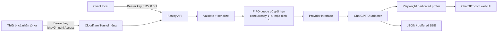

# tab2api

[](https://github.com/tang-vu/tab2api/actions/workflows/ci.yml)
[](https://github.com/tang-vu/tab2api/actions/workflows/desktop.yml)
[](package.json)
[](LICENSE)

`tab2api` là REST bridge local-first, tương thích một phần với OpenAI, dùng **phiên ChatGPT.com do chính bạn đăng nhập thủ công**. Sản phẩm hỗ trợ chat text, vision qua ảnh upload, tạo ảnh qua UI và transcription audio qua UI. Endpoint TTS WAV dùng engine giọng nói cục bộ của hệ điều hành và được ghi nhãn trung thực.

Đây là browser automation không chính thức, không phải OpenAI API chính thức. Giao diện ChatGPT thay đổi có thể làm công cụ hỏng. Công cụ chỉ dành cho một người trên máy cá nhân, không phù hợp production và không được triển khai thành proxy public/shared.

tab2api là dự án cộng đồng độc lập, không liên kết, được bảo trợ hay chứng thực bởi OpenAI, ChatGPT, Cloudflare, Microsoft, Google hoặc các nhà duy trì dependency khác. Tên sản phẩm và công ty là nhãn hiệu của chủ sở hữu tương ứng. Người dùng tự chịu trách nhiệm tuân thủ điều khoản và chính sách của mọi dịch vụ mình sử dụng.

## Kiến trúc



Không gọi endpoint private của ChatGPT. Direct Playwright dùng transport riêng; desktop shell chỉ cấp một CDP endpoint loopback tạm thời cho chính sidecar của app. Server từ chối bind ngoài `127.0.0.1`/`::1`.

Truy cập từ xa tùy chọn chỉ dành cho các thiết bị của cùng chủ sở hữu. Origin vẫn ở loopback và mỗi thiết bị cần một tab2api key có thể revoke. Cloudflare Access được khuyến nghị; chế độ bearer-only phải được chọn rõ ràng. Xem [hướng dẫn Cloudflare](docs/cloudflare.md).

## Yêu cầu

- Node.js 22.13+ và npm
- Tài khoản ChatGPT thuộc sở hữu của bạn
- Desktop tương tác được cho lần đăng nhập đầu
- Chromium cho direct Playwright (`npx playwright install chromium`); app desktop đóng gói sẵn đúng revision Chromium tương thích

## Bắt đầu trên Windows PowerShell

```powershell
git clone https://github.com/tang-vu/tab2api.git
Set-Location tab2api
npm ci
Copy-Item .env.example .env
npm run login
```

Trình duyệt với profile riêng sẽ mở. Tự đăng nhập trong trình duyệt; không nhập email/mật khẩu vào terminal. Nếu có CAPTCHA/security challenge, tự xử lý thủ công. Khi CLI báo `ready`, mở PowerShell khác:

```powershell
Set-Location tab2api
npm run build
npm start
$token = (Get-Content .tab2api/api-token -Raw).Trim()
```

Token API local ngẫu nhiên được tạo ở `.tab2api/api-token` và không được log.

### Ứng dụng desktop Rust/Tauri

Thư mục `desktop/` chứa app điều khiển Tauri 2 cho người dùng không muốn cài riêng Node.js, Chrome hoặc Playwright. Rust quản lý cửa sổ native, system tray, thư mục app-local và vòng đời sidecar có giới hạn; Node sidecar đóng gói vẫn dùng implementation Fastify/Playwright đã được kiểm thử. ChatGPT mở trong Chromium dedicated đi kèm để người dùng tự đăng nhập, tuyệt đối không được nhúng trong system WebView.

Build bản preview Windows self-contained chưa ký:

```powershell
npm ci
npm run desktop:check
npm run desktop:build:windows
npm run desktop:smoke:windows
```

Pipeline chỉ stage production dependencies và tải đúng Chromium headed revision khớp Playwright. Resource sinh ra, installer, runtime và profile đều được gitignore. File trong `desktop/target/release/bundle/nsis/` là developer preview; bản public vẫn cần code signing và clean-machine install test. Xem [hướng dẫn desktop](docs/desktop.md).

App desktop có Settings đa ngôn ngữ và hướng dẫn Cloudflare Tunnel đầy đủ bằng tiếng Anh, Việt, Trung, Nhật, Hàn, Tây Ban Nha, Pháp và Đức. Lần chạy đầu app chọn ngôn ngữ hoàn toàn cục bộ theo locale hệ điều hành—không định vị bằng IP—và người dùng có thể đổi ngôn ngữ đã lưu bất cứ lúc nào.

## Bắt đầu trên macOS/Linux

```bash
git clone https://github.com/tang-vu/tab2api.git
cd tab2api
npm ci
npx playwright install chromium
cp .env.example .env
npm run login
npm run build && npm start
```

## Ví dụ API

Chat Completions trong PowerShell:

```powershell
curl.exe http://127.0.0.1:3210/v1/chat/completions `
  -H "Authorization: Bearer $token" `
  -H "Content-Type: application/json" `
  -d '{"model":"chatgpt-web","messages":[{"role":"user","content":"Xin chào"}]}'
```

Responses:

```powershell
curl.exe http://127.0.0.1:3210/v1/responses `
  -H "Authorization: Bearer $token" `
  -H "Content-Type: application/json" `
  -d '{"model":"chatgpt-web","instructions":"Trả lời ngắn.","input":"Local-first là gì?"}'
```

Tạo ảnh:

```powershell
curl.exe http://127.0.0.1:3210/v1/images/generations `
  -H "Authorization: Bearer $token" `
  -H "Content-Type: application/json" `
  -d '{"model":"chatgpt-web-image","prompt":"Một hình tròn xanh trên nền trắng","response_format":"b64_json"}'
```

Speech dùng `/v1/audio/speech` với JSON và trả WAV. Transcription dùng multipart tại `/v1/audio/transcriptions`. Xem [tài liệu API](docs/api.md) để biết schema và giới hạn media chính xác.

Làm việc với codebase lớn thì dùng ChatGPT project: upload nguồn một lần thay vì gửi lại theo từng request.

```powershell
$project = (curl.exe http://127.0.0.1:3210/v1/projects `
  -H "Authorization: Bearer $token" -H "Content-Type: application/json" `
  -d '{"name":"codebase cua toi"}' | ConvertFrom-Json).id

curl.exe "http://127.0.0.1:3210/v1/projects/$project/files" `
  -H "Authorization: Bearer $token" `
  -F "file=@src/index.ts;type=text/plain"

curl.exe "http://127.0.0.1:3210/v1/projects/$project/chat/completions" `
  -H "Authorization: Bearer $token" -H "Content-Type: application/json" `
  -d '{"model":"chatgpt-web","messages":[{"role":"user","content":"Dự án này làm gì?"}]}'
```

Response trả kèm `tab2api.conversation_id`; gửi lại giá trị đó qua `conversation_id` để tiếp tục đúng hội thoại thay vì mở hội thoại mới.

Cấu hình client JavaScript tương thích OpenAI:

```ts
const client = new OpenAI({
  baseURL: 'http://127.0.0.1:3210/v1',
  apiKey: readFileSync('.tab2api/api-token', 'utf8').trim(),
});
```

## Vận hành và giới hạn

Mỗi request mở một hội thoại mới. `TAB2API_CONCURRENCY` cho phép 1–4 tab chạy song song; mặc định an toàn là 1. Chỉ nên thử mức 2 sau khi test thật vì một tài khoản có thể bị rate-limit và mỗi tab tốn RAM. Queue vẫn bị giới hạn và giữ thứ tự FIFO. `npm run doctor` kiểm tra Node, browser, quyền ghi, port, token local, kết nối, trạng thái đăng nhập và selector. `npm run reset-session` đóng browser process nhưng giữ profile/login.

### API key, thống kê và truy cập từ xa

Token trong `.tab2api/api-token` là key administrator. Tạo key client có thể revoke cho từng máy bằng `npm run keys -- create "laptop cá nhân"`; plaintext chỉ hiện một lần và runtime chỉ lưu SHA-256 digest. Dùng `npm run keys -- list`, `npm run keys -- revoke <id>` và `npm run usage` để quản lý/xem thống kê.

Số request, thành công/thất bại, latency và bytes là số đo thực. Token chỉ là ước tính vì ChatGPT Web không cung cấp usage chính xác; không dùng cho billing. Với hostname tùy chọn do chính chủ máy cấu hình, làm theo [docs/cloudflare.md](docs/cloudflare.md). Installer mặc định kiểm tra Access; lệnh bearer-only riêng yêu cầu chủ máy chủ động lựa chọn.

### Tự chạy trên Windows

Sau khi cấu hình `.env` và build, cài Scheduled Task cho user hiện tại:

```powershell
npm run build
npm run autostart:install
npm run autostart:status
```

Task chạy nền khi user đăng nhập Windows và dùng watchdog có giới hạn cùng cơ chế restart của Task Scheduler khi process lỗi. Log đã redact nằm tại `.tab2api/service.log` và được gitignore. Đây là availability best-effort trên desktop, không phải bảo đảm uptime production: logout, sleep/mất điện, CAPTCHA, rate limit, UI đổi hoặc browser không chạy đều có thể làm generation ngừng. Gỡ task bằng `npm run autostart:remove`; profile và dữ liệu runtime được giữ lại.

- Hỗ trợ text với role `system`, `developer`, `user`, `assistant`; vision nhận data URL PNG/JPEG/WebP có giới hạn và từ chối URL ảnh từ xa.
- Nhóm endpoint project (`/v1/projects`, `/v1/projects/:projectId/files`, `/v1/projects/:projectId/chat/completions`, `/v1/projects/:projectId/responses`) điều khiển chính UI công khai của ChatGPT. `GET /v1/projects` đọc trạng thái thật của trình duyệt chứ không phải database của tab2api, và `DELETE` tác động lên đúng id client gửi lên nên có thể xoá cả project bạn tự tạo tay. Xoá là không hoàn tác được.
- Project giữ file và instructions đã upload, nhưng ChatGPT vẫn quyết định dùng bao nhiêu trong đó cho mỗi câu trả lời. Project không thay thế được context window lớn, và memory ở cấp tài khoản không bị cô lập theo project.
- Model trả về luôn là `chatgpt-web`; tên model client gửi không điều khiển model picker trên UI.
- Không hỗ trợ tool calling, sửa ảnh, voice realtime, MP3 TTS, structured output hoặc logprobs.
- Ảnh output là PNG lossless được render từ phần tử UI ở đúng kích thước pixel nội tại, không phải preview nhỏ trong chat. Pixel do UI cung cấp được giữ nguyên, nhưng file không giống byte-for-byte với asset nguồn và có thể thiếu metadata. Chỉ hỗ trợ `n=1`, `size=auto`, `quality=auto`, `b64_json`.
- TTS dùng engine OS và không giả là giọng OpenAI/ChatGPT. STT upload audio qua UI nên không khẳng định model transcription cụ thể.
- UI không cho biết token usage: Chat Completions dùng số 0 kèm `usage_available=false`; Responses dùng `usage: null`. Đây là “không biết”, không phải usage thực bằng 0.
- `stream: true` là buffered fallback: đợi browser hoàn tất rồi mới gửi một delta. Chat Completions kết thúc bằng `[DONE]`, Responses bằng `response.completed`; đây không phải token streaming thời gian thực.
- Không bypass CAPTCHA, Cloudflare, rate limit hay security challenge; không stealth/fingerprint spoofing; không retry prompt sau lỗi mơ hồ.
- Profile `.tab2api` tương đương thông tin đăng nhập nhạy cảm. Không chia sẻ/sync/commit thư mục này và không dùng profile Chrome cá nhân mặc định.

Xem [API](docs/api.md), [security](docs/security.md), [troubleshooting](docs/troubleshooting.md), và [hướng dẫn đóng góp](CONTRIBUTING.md).

## Phát triển

```text
npm run dev
npm run build
npm start
npm test
npm run check
npm run login
npm run doctor
npm run smoke
npm run keys -- create "tên thiết bị"
npm run keys -- list
npm run usage
npm run desktop:check
npm run desktop:dev
npm run desktop:build:windows
npm run desktop:smoke:windows
npm run autostart:install
npm run autostart:status
npm run autostart:remove
npm run tunnel:install
npm run tunnel:install:bearer-only
npm run tunnel:status
npm run tunnel:remove
```

Manual E2E không chạy trong CI. Chỉ sau khi đọc prompt test và đăng nhập, bật rõ ràng bằng `$env:TAB2API_MANUAL_E2E='1'; npm run test:manual`. Không có biến này thì test được skip.

Xem thêm [API](docs/api.md), [Cloudflare](docs/cloudflare.md), [đóng góp](CONTRIBUTING.md), [hỗ trợ](SUPPORT.md), [chính sách bảo mật](SECURITY.md), [changelog](CHANGELOG.md), [notices](NOTICE.md) và [Code of Conduct](CODE_OF_CONDUCT.md). Dự án dùng giấy phép MIT.
