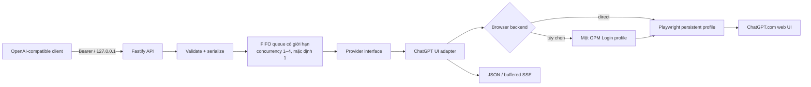

# tab2api

`tab2api` là REST bridge local-first, tương thích một phần với OpenAI, dùng **phiên ChatGPT.com do chính bạn đăng nhập thủ công**. Fastify nhận request tại loopback, Playwright thao tác giao diện web công khai trong profile Chromium riêng, rồi chuyển câu trả lời nhìn thấy thành JSON/SSE.

Đây là browser automation không chính thức, không phải OpenAI API chính thức. Giao diện ChatGPT thay đổi có thể làm công cụ hỏng. Công cụ chỉ dành cho một người trên máy cá nhân, không phù hợp production và không được triển khai thành proxy public/shared.

## Kiến trúc



Không gọi endpoint private của ChatGPT. Direct Playwright không mở TCP DevTools port; GPM mode chỉ chấp nhận Local API và DevTools WebSocket trên loopback. Server từ chối bind ngoài `127.0.0.1`/`::1`.

## Yêu cầu

- Node.js 22+ và npm
- Tài khoản ChatGPT thuộc sở hữu của bạn
- Desktop tương tác được cho lần đăng nhập đầu
- Chromium cho direct Playwright (`npx playwright install chromium`) hoặc GPM Login với đúng một profile có sẵn

## Bắt đầu trên Windows PowerShell

```powershell
git clone https://github.com/your-name/tab2api.git
Set-Location tab2api
npm ci
Copy-Item .env.example .env
# Với GPM mode, điền UUID của một profile vào TAB2API_GPM_PROFILE_ID trong .env.
npm run login
```

Trình duyệt với profile riêng sẽ mở. Tự đăng nhập trong trình duyệt; không nhập email/mật khẩu vào terminal. Nếu có CAPTCHA/security challenge, tự xử lý thủ công. Khi CLI báo `ready`, mở PowerShell khác:

```powershell
Set-Location tab2api
npm run build
npm start
$token = (Get-Content .tab2api/api-token -Raw).Trim()
```

Token API local ngẫu nhiên được tạo ở `.tab2api/api-token` và không được log.

### Dùng GPM Login

Trong `.env`, đặt `TAB2API_BROWSER_BACKEND=gpm`, `TAB2API_GPM_PROFILE_ID=<uuid-profile-duy-nhất>` và `TAB2API_GPM_BASE_URL` đúng với Local API loopback. Mở ứng dụng GPM Login trước khi chạy `npm run login` hoặc `npm start`. Nếu GPM dùng port dự phòng thay vì 9495, lấy port trong file `http.port` của GPM.

tab2api chỉ gọi get/start/stop profile đã cấu hình; không tạo, liệt kê, sửa, xóa hoặc xoay profile và không quản lý proxy/fingerprint. Local API và DevTools port của GPM không có authentication do tab2api kiểm soát, vì vậy process độc hại cùng OS user là rủi ro còn lại.

GPM mode bỏ qua `TAB2API_HEADLESS`; cách hiển thị cửa sổ do GPM Login quyết định. Khi tab2api dừng, login CLI hoàn tất hoặc reset-session được gọi, browser GPM đã cấu hình sẽ dừng nhưng dữ liệu profile được giữ. GPM không tự giải quyết việc ChatGPT đổi selector/UI.

## Bắt đầu trên macOS/Linux

```bash
git clone https://github.com/your-name/tab2api.git
cd tab2api
npm ci
npx playwright install chromium
cp .env.example .env
npm run login
npm run build && npm start
```

## Ví dụ API

Chat Completions trong PowerShell:

```powershell
curl.exe http://127.0.0.1:3210/v1/chat/completions `
  -H "Authorization: Bearer $token" `
  -H "Content-Type: application/json" `
  -d '{"model":"chatgpt-web","messages":[{"role":"user","content":"Xin chào"}]}'
```

Responses:

```powershell
curl.exe http://127.0.0.1:3210/v1/responses `
  -H "Authorization: Bearer $token" `
  -H "Content-Type: application/json" `
  -d '{"model":"chatgpt-web","instructions":"Trả lời ngắn.","input":"Local-first là gì?"}'
```

Cấu hình client JavaScript tương thích OpenAI:

```ts
const client = new OpenAI({
  baseURL: 'http://127.0.0.1:3210/v1',
  apiKey: readFileSync('.tab2api/api-token', 'utf8').trim(),
});
```

## Vận hành và giới hạn

Mỗi request mở một hội thoại mới. `TAB2API_CONCURRENCY` cho phép 1–4 tab chạy song song; mặc định an toàn là 1. Chỉ nên thử mức 2 sau khi test thật vì một tài khoản có thể bị rate-limit và mỗi tab tốn RAM. Queue vẫn bị giới hạn và giữ thứ tự FIFO. `npm run doctor` kiểm tra Node, browser, quyền ghi, port, token local, kết nối, trạng thái đăng nhập và selector. `npm run reset-session` đóng browser process nhưng giữ profile/login.

### Tự chạy trên Windows

Sau khi cấu hình `.env` và build, cài Scheduled Task cho user hiện tại:

```powershell
npm run build
npm run autostart:install
npm run autostart:status
```

Task chạy nền khi user đăng nhập Windows và dùng watchdog có giới hạn cùng cơ chế restart của Task Scheduler khi process lỗi. Log đã redact nằm tại `.tab2api/service.log` và được gitignore. GPM Login cũng phải tự mở cùng Windows và profile phải còn đăng nhập. Đây là availability best-effort trên desktop, không phải bảo đảm uptime production: logout, sleep/mất điện, CAPTCHA, rate limit, UI đổi hoặc GPM không chạy đều có thể làm generation ngừng. Gỡ task bằng `npm run autostart:remove`; profile và dữ liệu runtime được giữ lại.

- Chỉ hỗ trợ text với role `system`, `developer`, `user`, `assistant`; dữ liệu/field chưa hỗ trợ bị từ chối rõ ràng.
- Model trả về luôn là `chatgpt-web`; tên model client gửi không điều khiển model picker trên UI.
- Không hỗ trợ tool calling, ảnh, audio, structured output hoặc logprobs.
- UI không cho biết token usage: Chat Completions dùng số 0 kèm `usage_available=false`; Responses dùng `usage: null`. Đây là “không biết”, không phải usage thực bằng 0.
- `stream: true` là buffered fallback: đợi browser hoàn tất rồi mới gửi một delta. Chat Completions kết thúc bằng `[DONE]`, Responses bằng `response.completed`; đây không phải token streaming thời gian thực.
- Không bypass CAPTCHA, Cloudflare, rate limit hay security challenge; không stealth/fingerprint spoofing; không retry prompt sau lỗi mơ hồ.
- Profile `.tab2api` tương đương thông tin đăng nhập nhạy cảm. Không chia sẻ/sync/commit thư mục này và không dùng profile Chrome cá nhân mặc định.

Xem [API](docs/api.md), [security](docs/security.md), [troubleshooting](docs/troubleshooting.md), và [hướng dẫn đóng góp](CONTRIBUTING.md).

## Phát triển

```text
npm run dev
npm run build
npm start
npm test
npm run check
npm run login
npm run doctor
npm run smoke
npm run autostart:install
npm run autostart:status
npm run autostart:remove
```

Manual E2E không chạy trong CI. Chỉ sau khi đọc prompt test và đăng nhập, bật rõ ràng bằng `$env:TAB2API_MANUAL_E2E='1'; npm run test:manual`. Không có biến này thì test được skip.
