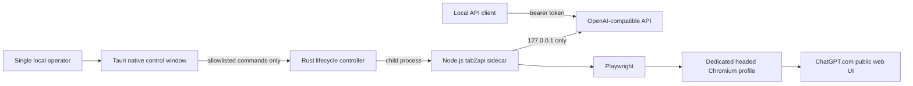

# Desktop application and distribution

## Status

The `desktop/` directory is an experimental Tauri 2 controller, not a signed end-user release. It provides a small native window and system tray for status, start, stop, and manual login. The existing TypeScript service and Playwright adapter remain the source of truth for the API and browser automation.

The development build is **not self-contained**: it starts `node ../dist/cli/index.js` and expects the Playwright-managed Chromium installation to exist. `TAB2API_DESKTOP_SIDECAR` can point to a trusted standalone executable for packaging experiments, but the repository does not currently ship such an executable or an installer. CI compiles with `--no-bundle` and deliberately uploads nothing.

## Architecture



Tauri's operating-system WebView renders only the local control UI. It does not render or automate ChatGPT. ChatGPT remains in a dedicated Playwright Chromium window so browser behavior and selectors stay consistent with the tested adapter. GPM Login is not used by the desktop shell.

The Rust layer owns the child-process boundary and forces `TAB2API_HOST=127.0.0.1` and `TAB2API_BROWSER_BACKEND=playwright`. Its frontend receives only a phase, a loopback endpoint, and a content-free status message. It never receives an API key, sidecar output, profile data, cookies, authorization headers, prompts, or responses. The WebView content security policy denies network connections.

Current lifecycle behavior is intentionally small:

- start waits up to 15 seconds for `GET /healthz` on IPv4 loopback;
- login is allowed only while the service child is stopped, preventing concurrent profile ownership;
- status probes only `127.0.0.1` and exposes no authenticated readiness data;
- stop and application exit terminate and reap the managed child;
- the profile and runtime data stay outside the application installation directory.

The current stop path force-terminates the child. A distributable release should first add a bounded authenticated graceful-shutdown handshake, followed by forced termination only after a deadline.

## Development

Install Node.js 22+, the Rust toolchain declared by `desktop/Cargo.toml`, and the platform prerequisites from the [official Tauri prerequisites](https://v2.tauri.app/start/prerequisites/). Windows development requires the MSVC C++ build tools and WebView2; macOS requires Xcode Command Line Tools; Linux requires WebKitGTK 4.1 and the tray/application-indicator libraries.

Build and run from the repository root:

```powershell
npm ci
npm run build
npx playwright install chromium
cd desktop
cargo install tauri-cli --version 2.11.4 --locked
cargo tauri dev
```

Use only your own dedicated profile and log in manually. Development and CI commands must not contact ChatGPT.com automatically.

Validate the desktop code:

```powershell
npm run build
cargo fmt --manifest-path desktop/Cargo.toml --all -- --check
cargo clippy --manifest-path desktop/Cargo.toml --locked --all-targets --all-features -- -D warnings
cargo test --manifest-path desktop/Cargo.toml --locked --all-targets --all-features
cd desktop
cargo tauri build --no-bundle
```

`desktop.yml` runs those checks on Windows, macOS, and Ubuntu 22.04. It skips the Playwright browser download, has read-only repository permissions, supplies no production secrets, creates no installer, and publishes no artifact or release. The build proves compilation; it is not an installation test.

## Self-contained packaging target

The preferred OSS distribution remains a Tauri/Rust shell around the existing Node.js/Playwright implementation. Rewriting browser automation in Rust or loading ChatGPT inside the system WebView would add platform-specific behavior without eliminating the need to maintain a browser engine.

A future signed installer should contain all executable dependencies needed at runtime:

1. Build `dist/` from a clean `npm ci` checkout and stage only audited production dependencies.
2. Package a platform-native Node.js 22 runtime or a tested standalone sidecar executable. Do not assume `node` is on the user's `PATH`.
3. Package the Playwright version-matched Chromium build in an application resource directory and set an internal browser path. Do not use the user's default Chrome profile.
4. Register the platform-specific sidecar/resource paths in Tauri configuration. Validate resolved paths before execution; never accept an executable path from the WebView.
5. Keep `.tab2api/`, the browser profile, API keys, usage metadata, and opt-in debug artifacts in the per-user application-data directory, outside the signed/read-only installation tree.
6. Include third-party notices and licenses for Node.js, Chromium, Playwright, Rust crates, and JavaScript dependencies.
7. Produce installers on native, pinned build images. Code-sign Windows packages and sign/notarize macOS packages before calling them releases.

Bundling Chromium makes the download much larger and transfers browser patch responsibility to tab2api maintainers. A release policy must define how quickly a Playwright/Chromium security update is rebuilt and shipped. The application must never silently fall back to a personal system browser profile.

Tauri supports separating compilation from bundling with `tauri build --no-bundle`; see the [official distribution guide](https://v2.tauri.app/distribute/). Installer generation should remain a separate, protected release workflow.

## Release workflow recommendation

Do not turn pull-request CI into a publishing pipeline. Add a separate release workflow only after the staging layout and clean-machine install tests exist. That workflow should:

- run only for protected semantic-version tags after maintainer approval;
- pin actions and toolchains, use least-privilege permissions, and isolate signing secrets to environment-protected native jobs;
- build each OS artifact on that OS and verify the embedded sidecar and Chromium checksums;
- install into a clean VM, start offline with a fake adapter, verify loopback binding/authentication, uninstall, and confirm the user profile is retained unless deletion was explicitly selected;
- generate checksums, an SBOM, provenance, third-party notices, and a changelog;
- sign/notarize before publishing and never include `.env`, `.tab2api/`, profiles, tokens, logs, screenshots, or tunnel credentials;
- require an explicit maintainer promotion step before creating a GitHub Release.

An updater should not be enabled until update manifests and binaries are cryptographically signed, downgrade behavior is defined, and profile/schema compatibility is tested. Autostart must remain opt-in and must not create a second service alongside an existing Scheduled Task or login item.

## Acceptance criteria for the first distributable preview

- A clean Windows machine can install and run without separately installing Node.js, Chrome, GPM, or Playwright.
- The first-login button opens the bundled, dedicated Chromium profile in headed mode.
- Start, stop, quit, crash recovery, reboot/autostart opt-in, update, and uninstall have automated lifecycle tests.
- The API and browser debugging transport remain loopback-only, and non-loopback configuration is rejected.
- The UI never receives or persists API tokens or conversation content.
- A fake-adapter smoke test passes inside each packaged application without network access.
- No unsigned artifact is described as an official release.
- Windows signing, macOS signing/notarization, checksums, SBOM, dependency notices, and update ownership are documented.

Until these criteria pass, build from source and treat the desktop shell as a developer preview.
